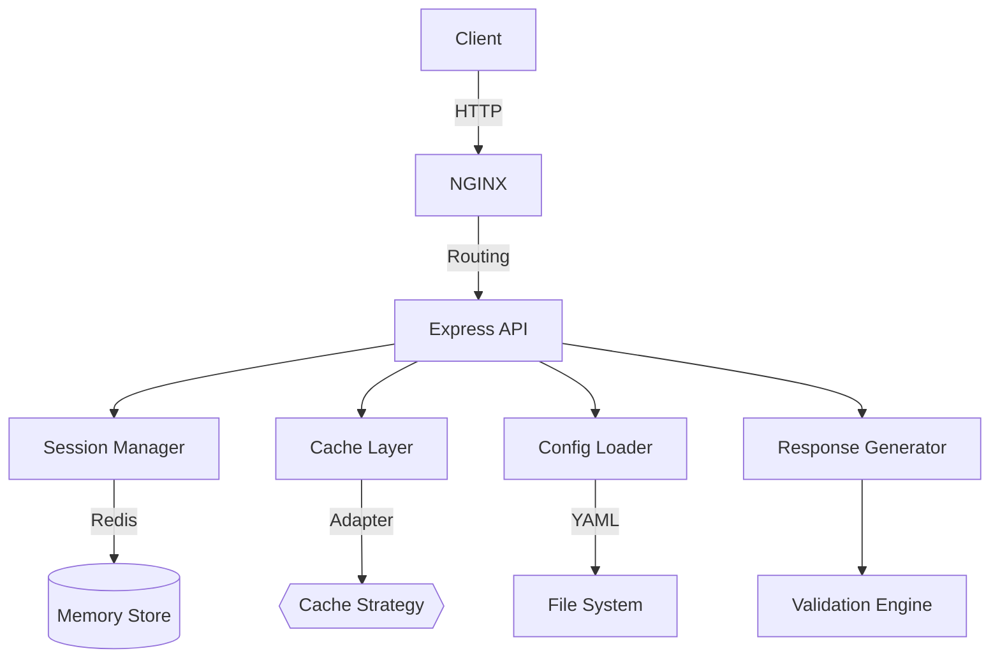
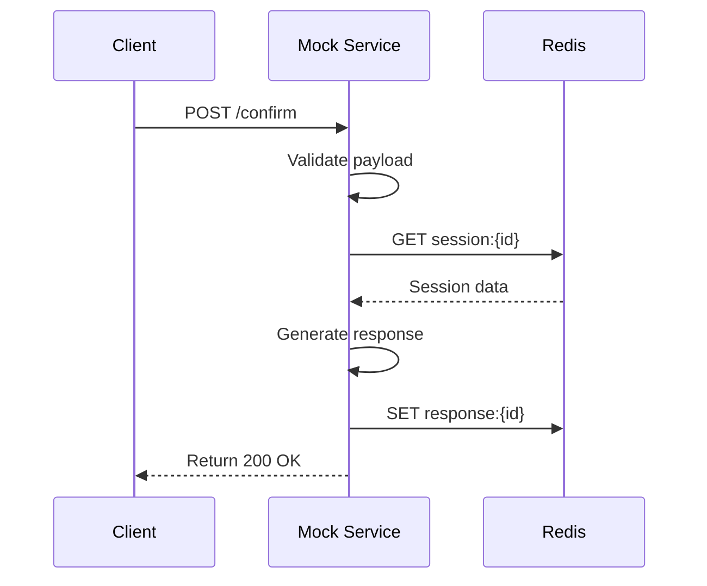
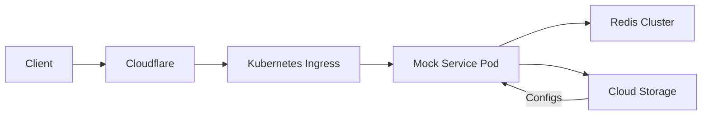
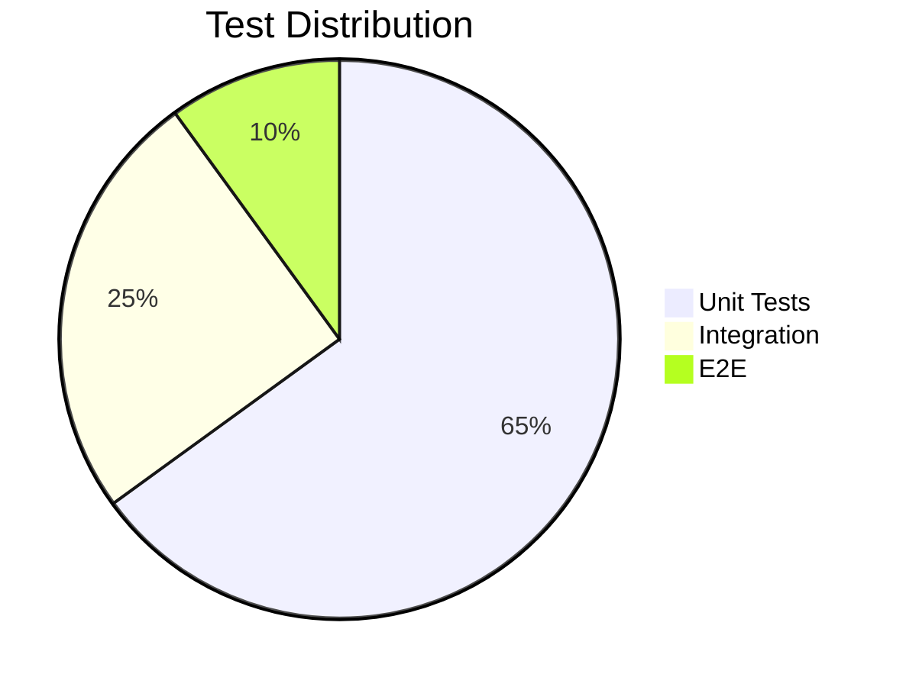
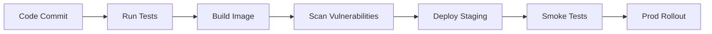

# Automation Mock Service Implementation Approach

## 1. Core Architecture

### Component Diagram



## 2. Runtime Modes

### Standalone Mode Features

- 🚫 No external dependencies
- 🗄️ In-memory data storage
- 📁 Local file logging
- 🐳 Single-container deployment

```bash
# Standalone startup
MODE=standalone npm start
```

### Local Dev Mode Setup

```yaml
# docker-compose.dev.yml
services:
  mock-api:
    build: .
    ports: ["3000:3000"]
    environment:
      - NODE_ENV=development
  redis:
    image: redis:alpine
    ports: ["6379:6379"]
```

## 3. Configuration Management

### Environment Structure

```
config/
├── actions/
│   ├── search.yaml
│   └── confirm.yaml
└── factory.yaml
```

### Config Loader Implementation

```typescript
interface ActionConfig {
  action_id: string;
  default: string;
  validations?: ValidationRule[];
}

export async function loadActionConfig(action: string): Promise<ActionConfig> {
  const config = await fs.readFile(`config/actions/${action}.yaml`);
  return yaml.parse(config.toString());
}
```

## 4. Request Processing

### Sequence Flow



## 5. Validation Framework

### Rule Definition

```yaml
# confirm.yaml
validations:
  - path: $.message.items[0].id
    type: required
    error: Item ID missing
  - path: $.context.transaction_id
    type: regex
    pattern: ^TX-\d{10}$
    error: Invalid transaction ID
```

## 6. Deployment Strategy

### Production Architecture



## 7. Testing Approach

### Test Pyramid



### Postman Collection Structure

```json
{
  "item": [
    {
      "name": "Order Lifecycle",
      "item": [
        {
          "name": "Create Order",
          "event": [
            {
              "script": "pm.test('Order created', () => pm.expect(pm.response.code).to.be.200)"
            }
          ]
        }
      ]
    }
  ]
}
```

## 8. Monitoring

### Log Structure Example

```json
{
  "timestamp": "2023-07-16T12:30:45Z",
  "action": "confirm",
  "duration": 142,
  "status": 200,
  "session": "abcd-1234",
  "errors": [],
  "cache_hit": true
}
```

## 9. CI/CD Pipeline



## 10. Getting Started

### Local Development

```bash
# Clone repo
git clone https://github.com/org/mock-service.git
cd mock-service

# Install dependencies
npm ci

# Start in standalone mode
MODE=standalone npm run dev

# Run tests
npm test
```

```

```
